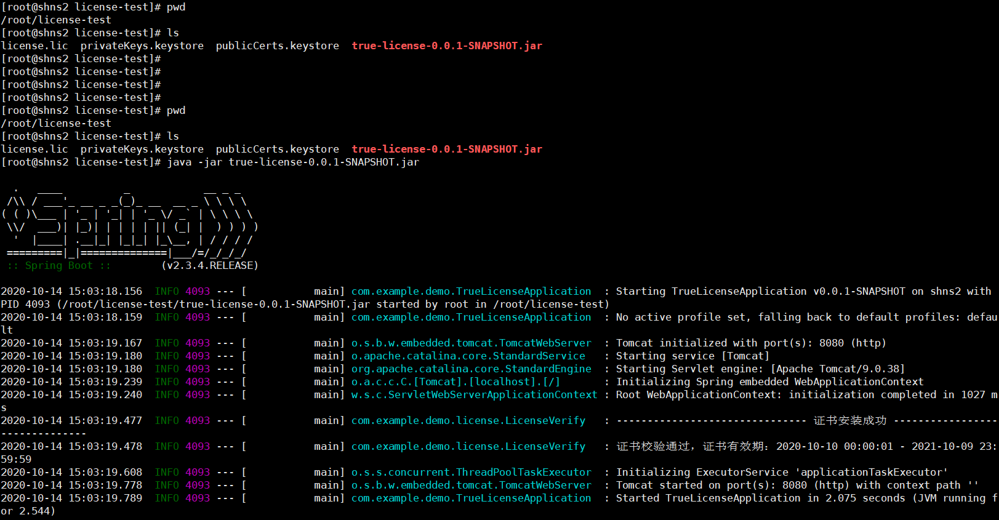

- [ 前言](#head1)
- [SpringBoot 整合 TrueLicense](#head2)
	- [ 添加依赖](#head3)
	- [License 服务器校验参数](#head4)
	- [License 创建参数](#head5)
	- [ 获取服务器硬件信息抽象类](#head6)
	- [获取客户 Linux 服务器的基本信息](#head7)
	- [获取客户 Windows 服务器的基本信息](#head8)
	- [自定义 License 管理，创建、安装、校验等](#head9)
	- [ 自定义密钥存储](#head10)
	- [License 创建](#head11)
	- [ 证书配置](#head12)
	- [License 校验、安装、卸载](#head13)
	- [License 生成证书 Service](#head14)
		- [ LicenseCreatorService](#head15)
		- [ LicenseCreatorServiceImpl](#head16)
	- [License 生成证书 Controller](#head17)
- [TrueLicense 创建、安装证书](#head18)
	- [使用 keytool 生成公私钥证书库](#head19)
	- [ 项目配置](#head20)
	- [为客户生成 license 文件](#head21)
- [ 证书有效性校验](#head22)
- [ [源码](https://github.com/JCXTB/TrueLicense)](#head23)
# <span id="head1"> 前言</span>
License，即版权许可证，一般用于收费软件给付费用户提供的访问许可证明。根据应用部署位置的不同，一般可以分为以下两种情况讨论：
- 应用部署在开发者自己的云服务器上。这种情况下用户通过账号登录的形式远程访问，因此只需要在账号登录的时候校验目标账号的有效期、访问权限等信息即可。
- 应用部署在客户的内网环境。因为这种情况开发者无法控制客户的网络环境，也不能保证应用所在服务器可以访问外网，因此通常的做法是使用服务器许可文件，在应用启动的时候加载证书，然后在登录或者其他关键操作的地方校验证书的有效性。

本文只考虑代码层面的许可限制，暂不考虑逆向破解问题。

# <span id="head2">SpringBoot 整合 TrueLicense</span>
## <span id="head3"> 添加依赖</span>
```
<dependency>
<groupId>de.schlichtherle.truelicense</groupId>
<artifactId>truelicense-core</artifactId>
<version>1.33</version>
<scope>provided</scope>
</dependency>
```
TrueLicense 的 ```de.schlichtherle.license.LicenseManager``` 类自带的 verify 方法只校验了我们后面颁发的许可文件的生效和过期时间，然而在实际项目中我们可能需要额外校验应用部署的服务器的 IP 地址、MAC 地址、CPU 序列号、主板序列号等信息，因此我们需要复写框架的部分方法以实现校验自定义参数的目的。
## <span id="head4">License 服务器校验参数</span>
```
/**
* Project Name: true-license
* File Name: LicenseCheckModel
* Package Name: com.example.demo.entity
* Date: 2020/10/10 10:42
* Author: 方瑞冬
*/
package com.example.demo.license;

import lombok.Data;

import java.io.Serializable;
import java.util.List;

/**
* @author 方瑞冬
* License 服务器校验参数
*/
@Data
public class LicenseCheckModel implements Serializable {
private static final long serialVersionUID = 1L;

/**
* 可被允许的 IP  地址
*/
private List<String> ipAddress;

/**
* 可被允许的 MAC 地址
*/
private List<String> macAddress;

/**
* 可被允许的 CPU 序列号
*/
private String cpuSerial;

/**
* 可被允许的主板序列号
*/
private String mainBoardSerial;
}
```
## <span id="head5">License 创建参数</span>
```
/**
* Project Name: true-license
* File Name: LicenseCreatorParam
* Package Name: com.example.demo.entity
* Date: 2020/10/10 10:49
* Author: 方瑞冬
*/
package com.example.demo.license;

import com.fasterxml.jackson.annotation.JsonFormat;
import lombok.Data;

import java.io.Serializable;
import java.util.Date;

/**
* @author 方瑞冬
* License 创建参数
*/
@Data
public class LicenseCreatorParam implements Serializable {
private static final long serialVersionUID = 1L;

/**
* 证书 subject
*/
private String subject;

/**
* 密钥（私钥）别称
*/
private String privateAlias;

/**
* 密钥（私钥）密码（需要妥善保管，不能让使用者知道）
*/
private String keyPass;

/**
* 访问秘钥库（私钥）的密码
*/
private String storePass;

/**
* 证书生成路径
*/
private String licensePath;

/**
* 密钥（私钥）库存储路径
*/
private String privateKeysStorePath;

/**
* 证书生效时间
*/
@JsonFormat(pattern = "yyyy-MM-dd HH:mm:ss", timezone = "GMT+8")
private Date issuedTime = new Date();

/**
* 证书失效时间
*/
@JsonFormat(pattern = "yyyy-MM-dd HH:mm:ss", timezone = "GMT+8")
private Date expiryTime;

/**
* 用户类型
*/
private String consumerType = "user";

/**
* 用户数量
*/
private Integer consumerAmount = 1;

/**
* 描述信息
*/
private String description = "";

/**
* 额外的 License 校验参数
*/
private LicenseCheckModel licenseCheckModel;
}
```
## <span id="head6"> 获取服务器硬件信息抽象类</span>
```
/**
* Project Name: true-license
* File Name: AbstractServerInfos
* Package Name: com.example.demo.abstracts
* Date: 2020/10/10 10:56
* Author: 方瑞冬
*/
package com.example.demo.license;

import lombok.extern.slf4j.Slf4j;

import java.net.InetAddress;
import java.net.NetworkInterface;
import java.net.SocketException;
import java.util.ArrayList;
import java.util.Enumeration;
import java.util.List;

/**
* @author 方瑞冬
* 获取服务器的硬件信息
*/
@Slf4j
public abstract class AbstractServerInfos {
/**
* <p>项目名称: true-license-demo </p>
* <p>文件名称: AbstractServerInfos.java </p>
* <p>方法描述: 组装需要额外校验的License参数 </p>
* <p>创建时间: 2020/10/10 11:01 </p>
*
* @return LicenseCheckModel
* @author 方瑞冬
* @version 1.0
*/
public LicenseCheckModel getServerInfos() {
LicenseCheckModel result = new LicenseCheckModel();

try {
result.setIpAddress(this.getIpAddress());
result.setMacAddress(this.getMacAddress());
result.setCpuSerial(this.getCPUSerial());
result.setMainBoardSerial(this.getMainBoardSerial());
} catch (Exception e) {
log.error("获取服务器硬件信息失败", e);
}

return result;
}

/**
* <p>项目名称: true-license-demo </p>
* <p>文件名称: AbstractServerInfos.java </p>
* <p>方法描述: 获取 IP 地址 </p>
* <p>创建时间: 2020/10/10 11:02 </p>
*
* @return java.util.List<java.lang.String>
* @author 方瑞冬
* @version 1.0
*/
protected abstract List<String> getIpAddress() throws Exception;

/**
* <p>项目名称: true-license-demo </p>
* <p>文件名称: AbstractServerInfos.java </p>
* <p>方法描述: 获取 Mac 地址 </p>
* <p>创建时间: 2020/10/10 11:02 </p>
*
* @return java.util.List<java.lang.String>
* @author 方瑞冬
* @version 1.0
*/
protected abstract List<String> getMacAddress() throws Exception;

/**
* <p>项目名称: true-license-demo </p>
* <p>文件名称: AbstractServerInfos.java </p>
* <p>方法描述: 获取 CPU 序列号 </p>
* <p>创建时间: 2020/10/10 11:02 </p>
*
* @return java.lang.String
* @author 方瑞冬
* @version 1.0
*/
protected abstract String getCPUSerial() throws Exception;

/**
* <p>项目名称: true-license-demo </p>
* <p>文件名称: AbstractServerInfos.java </p>
* <p>方法描述: 获取主板序列号 </p>
* <p>创建时间: 2020/10/10 11:02 </p>
*
* @return java.lang.String
* @author 方瑞冬
* @version 1.0
*/
protected abstract String getMainBoardSerial() throws Exception;

/**
* <p>项目名称: true-license-demo </p>
* <p>文件名称: AbstractServerInfos.java </p>
* <p>方法描述: 获取当前服务器所有符合条件的 InetAddress </p>
* <p>创建时间: 2020/10/10 11:02 </p>
*
* @return java.util.List<java.net.InetAddress>
* @author 方瑞冬
* @version 1.0
*/
protected List<InetAddress> getLocalAllInetAddress() throws Exception {
List<InetAddress> result = new ArrayList<>(4);

// 遍历所有的网络接口
for (Enumeration<NetworkInterface> networkInterfaces = NetworkInterface.getNetworkInterfaces(); networkInterfaces.hasMoreElements(); ) {
NetworkInterface iface = networkInterfaces.nextElement();
// 在所有的接口下再遍历 IP
for (Enumeration<InetAddress> inetAddresses = iface.getInetAddresses(); inetAddresses.hasMoreElements(); ) {
InetAddress inetAddr = inetAddresses.nextElement();

//排除 LoopbackAddress、SiteLocalAddress、LinkLocalAddress、MulticastAddress 类型的 IP 地址
if (!inetAddr.isLoopbackAddress() /*&& !inetAddr.isSiteLocalAddress()*/
&& !inetAddr.isLinkLocalAddress() && !inetAddr.isMulticastAddress()) {
result.add(inetAddr);
}
}
}
return result;
}

/**
* <p>项目名称: true-license-demo </p>
* <p>文件名称: AbstractServerInfos.java </p>
* <p>方法描述: 获取某个网络接口的 Mac 地址 </p>
* <p>创建时间: 2020/10/10 11:03 </p>
*
* @param inetAddr inetAddr
* @return java.lang.String
* @author 方瑞冬
* @version 1.0
*/
protected String getMacByInetAddress(InetAddress inetAddr) {
try {
byte[] mac = NetworkInterface.getByInetAddress(inetAddr).getHardwareAddress();
StringBuilder stringBuilder = new StringBuilder();
for (int i = 0; i < mac.length; i++) {
if (i != 0) {
stringBuilder.append("-");
}
//将十六进制 byte 转化为字符串
String temp = Integer.toHexString(mac[i] & 0xff);
if (temp.length() == 1) {
stringBuilder.append("0").append(temp);
} else {
stringBuilder.append(temp);
}
}
return stringBuilder.toString().toUpperCase();
} catch (SocketException e) {
e.printStackTrace();
}
return null;
}
}
```
## <span id="head7">获取客户 Linux 服务器的基本信息</span>
```
/**
* Project Name: true-license
* File Name: LinuxServerInfos
* Package Name: com.example.demo.entity
* Date: 2020/10/10 11:05
* Author: 方瑞冬
*/
package com.example.demo.license;

import org.springframework.util.StringUtils;

import java.io.BufferedReader;
import java.io.InputStreamReader;
import java.net.InetAddress;
import java.util.List;
import java.util.stream.Collectors;

/**
* @author 方瑞冬
* 获取客户 Linux 服务器的基本信息
*/
public class LinuxServerInfos extends AbstractServerInfos {
/**
* <p>项目名称: true-license-demo </p>
* <p>文件名称: LinuxServerInfos.java </p>
* <p>方法描述: 获取 IP 地址 </p>
* <p>创建时间: 2020/10/10 11:07 </p>
*
* @return java.util.List<java.lang.String>
* @author 方瑞冬
* @version 1.0
*/
@Override
protected List<String> getIpAddress() throws Exception {
List<String> result = null;

//获取所有网络接口
List<InetAddress> inetAddresses = getLocalAllInetAddress();

if (inetAddresses != null && inetAddresses.size() > 0) {
result = inetAddresses.stream().map(InetAddress::getHostAddress).distinct().map(String::toLowerCase).collect(Collectors.toList());
}

return result;
}

/**
* <p>项目名称: true-license-demo </p>
* <p>文件名称: LinuxServerInfos.java </p>
* <p>方法描述: 获取 Mac 地址 </p>
* <p>创建时间: 2020/10/10 11:08 </p>
*
* @return java.util.List<java.lang.String>
* @author 方瑞冬
* @version 1.0
*/
@Override
protected List<String> getMacAddress() throws Exception {
List<String> result = null;

//1. 获取所有网络接口
List<InetAddress> inetAddresses = getLocalAllInetAddress();

if (inetAddresses != null && inetAddresses.size() > 0) {
//2. 获取所有网络接口的 Mac 地址
result = inetAddresses.stream().map(this::getMacByInetAddress).distinct().collect(Collectors.toList());
}

return result;
}

/**
* <p>项目名称: true-license-demo </p>
* <p>文件名称: LinuxServerInfos.java </p>
* <p>方法描述: 获取 CPU 序列号 </p>
* <p>创建时间: 2020/10/10 11:08 </p>
*
* @return java.lang.String
* @author 方瑞冬
* @version 1.0
*/
@Override
protected String getCPUSerial() throws Exception {
//序列号
String serialNumber = "";

//使用 dmidecode 命令获取 CPU 序列号
String[] shell = {"/bin/bash", "-c", "dmidecode -t processor | grep 'ID' | awk -F ':' '{print $2}' | head -n 1"};
Process process = Runtime.getRuntime().exec(shell);
process.getOutputStream().close();

BufferedReader reader = new BufferedReader(new InputStreamReader(process.getInputStream()));

String line = reader.readLine().trim();
if (StringUtils.hasText(line)) {
serialNumber = line;
}

reader.close();
return serialNumber;
}

/**
* <p>项目名称: true-license-demo </p>
* <p>文件名称: LinuxServerInfos.java </p>
* <p>方法描述: 获取主板序列号 </p>
* <p>创建时间: 2020/10/10 11:08 </p>
*
* @return java.lang.String
* @author 方瑞冬
* @version 1.0
*/
@Override
protected String getMainBoardSerial() throws Exception {
//序列号
String serialNumber = "";
//使用 dmidecode 命令获取主板序列号
String[] shell = {"/bin/bash", "-c", "dmidecode | grep 'Serial Number' | awk -F ':' '{print $2}' | head -n 1"};
Process process = Runtime.getRuntime().exec(shell);
process.getOutputStream().close();

BufferedReader reader = new BufferedReader(new InputStreamReader(process.getInputStream()));
String line = reader.readLine().trim();
if (StringUtils.hasText(line)) {
serialNumber = line;
}
reader.close();
return serialNumber;
}
}
```
## <span id="head8">获取客户 Windows 服务器的基本信息</span>
```
/**
* Project Name: true-license
* File Name: WindowsServerInfos
* Package Name: com.example.demo.entity
* Date: 2020/10/10 11:14
* Author: 方瑞冬
*/
package com.example.demo.license;

import java.net.InetAddress;
import java.util.List;
import java.util.Scanner;
import java.util.stream.Collectors;

/**
* @author 方瑞冬
* 获取客户 Windows 服务器的基本信息
*/
public class WindowsServerInfos extends AbstractServerInfos {
/**
* <p>项目名称: true-license-demo </p>
* <p>文件名称: WindowsServerInfos.java </p>
* <p>方法描述: 获取 IP 地址 </p>
* <p>创建时间: 2020/10/10 11:22 </p>
*
* @return java.util.List<java.lang.String>
* @author 方瑞冬
* @version 1.0
*/
@Override
protected List<String> getIpAddress() throws Exception {
List<String> result = null;

//获取所有网络接口
List<InetAddress> inetAddresses = getLocalAllInetAddress();

if (inetAddresses != null && inetAddresses.size() > 0) {
result = inetAddresses.stream().map(InetAddress::getHostAddress).distinct().map(String::toLowerCase).collect(Collectors.toList());
}

return result;
}

/**
* <p>项目名称: true-license-demo </p>
* <p>文件名称: WindowsServerInfos.java </p>
* <p>方法描述: 获取 Mac 地址 </p>
* <p>创建时间: 2020/10/10 11:23 </p>
*
* @return java.util.List<java.lang.String>
* @author 方瑞冬
* @version 1.0
*/
@Override
protected List<String> getMacAddress() throws Exception {
List<String> result = null;

//1. 获取所有网络接口
List<InetAddress> inetAddresses = getLocalAllInetAddress();

if (inetAddresses != null && inetAddresses.size() > 0) {
//2. 获取所有网络接口的 Mac 地址
result = inetAddresses.stream().map(this::getMacByInetAddress).distinct().collect(Collectors.toList());
}

return result;
}

/**
* <p>项目名称: true-license-demo </p>
* <p>文件名称: WindowsServerInfos.java </p>
* <p>方法描述: 获取 CPU 序列号 </p>
* <p>创建时间: 2020/10/10 11:23 </p>
*
* @return java.lang.String
* @author 方瑞冬
* @version 1.0
*/
@Override
protected String getCPUSerial() throws Exception {
//序列号
String serialNumber = "";

//使用 WMIC 获取 CPU 序列号
Process process = Runtime.getRuntime().exec("wmic cpu get processorid");
process.getOutputStream().close();
Scanner scanner = new Scanner(process.getInputStream());

if (scanner.hasNext()) {
scanner.next();
}
if (scanner.hasNext()) {
serialNumber = scanner.next().trim();
}
scanner.close();
return serialNumber;
}

/**
* <p>项目名称: true-license-demo </p>
* <p>文件名称: WindowsServerInfos.java </p>
* <p>方法描述: 获取主板序列号 </p>
* <p>创建时间: 2020/10/10 11:23 </p>
*
* @return java.lang.String
* @author 方瑞冬
* @version 1.0
*/
@Override
protected String getMainBoardSerial() throws Exception {
//序列号
String serialNumber = "";
//使用 WMIC 获取主板序列号
Process process = Runtime.getRuntime().exec("wmic baseboard get serialnumber");
process.getOutputStream().close();
Scanner scanner = new Scanner(process.getInputStream());
if (scanner.hasNext()) {
scanner.next();
}
if (scanner.hasNext()) {
serialNumber = scanner.next().trim();
}
scanner.close();
return serialNumber;
}
}
```
## <span id="head9">自定义 License 管理，创建、安装、校验等</span>
```
/**
* Project Name: true-license
* File Name: CustomLicenseManager
* Package Name: com.example.demo.entity
* Date: 2020/10/10 13:02
* Author: 方瑞冬
*/
package com.example.demo.license;

import de.schlichtherle.license.*;
import de.schlichtherle.xml.GenericCertificate;
import lombok.extern.slf4j.Slf4j;
import org.springframework.util.StringUtils;

import java.beans.XMLDecoder;
import java.io.BufferedInputStream;
import java.io.ByteArrayInputStream;
import java.io.UnsupportedEncodingException;
import java.util.Date;
import java.util.List;

/**
* @author 方瑞冬
* 自定义 License 管理，创建、安装、校验等
*/
@Slf4j
public class CustomLicenseManager extends LicenseManager {
/**
* XML 编码
*/
private static final String XML_CHARSET = "UTF-8";
/**
* 默认 BUFSIZE
*/
private static final int DEFAULT_BUFSIZE = 8 * 1024;

public CustomLicenseManager(LicenseParam param) {
super(param);
}

/**
* <p>项目名称: true-license-demo </p>
* <p>文件名称: CustomLicenseManager.java </p>
* <p>方法描述: 重写 License 创建 </p>
* <p>创建时间: 2020/10/10 13:11 </p>
*
* @param content LicenseContent
* @param notary  LicenseNotary
* @return byte[]
* @author 方瑞冬
* @version 1.0
*/
@Override
protected synchronized byte[] create(LicenseContent content, LicenseNotary notary) throws Exception {
initialize(content);
this.validateCreate(content);
final GenericCertificate certificate = notary.sign(content);
return getPrivacyGuard().cert2key(certificate);
}

/**
* <p>项目名称: true-license-demo </p>
* <p>文件名称: CustomLicenseManager.java </p>
* <p>方法描述: 重写 License 安装 </p>
* <p>创建时间: 2020/10/10 13:13 </p>
*
* @param key    key
* @param notary LicenseNotary
* @return de.schlichtherle.license.LicenseContent
* @author 方瑞冬
* @version 1.0
*/
@Override
protected synchronized LicenseContent install(final byte[] key, final LicenseNotary notary) throws Exception {
final GenericCertificate certificate = getPrivacyGuard().key2cert(key);

notary.verify(certificate);
final LicenseContent content = (LicenseContent) this.load(certificate.getEncoded());
this.validate(content);
setLicenseKey(key);
setCertificate(certificate);

return content;
}

/**
* <p>项目名称: true-license-demo </p>
* <p>文件名称: CustomLicenseManager.java </p>
* <p>方法描述: 重写 License 校验 </p>
* <p>创建时间: 2020/10/10 13:14 </p>
*
* @param notary LicenseNotary
* @return de.schlichtherle.license.LicenseContent
* @author 方瑞冬
* @version 1.0
*/
@Override
protected synchronized LicenseContent verify(final LicenseNotary notary) throws Exception {
GenericCertificate certificate;

// Load license key from preferences,
final byte[] key = getLicenseKey();
if (null == key) {
throw new NoLicenseInstalledException(getLicenseParam().getSubject());
}

certificate = getPrivacyGuard().key2cert(key);
notary.verify(certificate);
final LicenseContent content = (LicenseContent) this.load(certificate.getEncoded());
this.validate(content);
setCertificate(certificate);

return content;
}

/**
* <p>项目名称: true-license-demo </p>
* <p>文件名称: CustomLicenseManager.java </p>
* <p>方法描述: 校验生成证书的参数信息 </p>
* <p>创建时间: 2020/10/10 13:14 </p>
*
* @param content LicenseContent
* @return void
* @author 方瑞冬
* @version 1.0
*/
protected synchronized void validateCreate(final LicenseContent content) throws LicenseContentException {
final Date now = new Date();
final Date notBefore = content.getNotBefore();
final Date notAfter = content.getNotAfter();
if (null != notAfter && now.after(notAfter)) {
throw new LicenseContentException("证书失效时间不能早于当前时间");
}
if (null != notBefore && null != notAfter && notAfter.before(notBefore)) {
throw new LicenseContentException("证书生效时间不能晚于证书失效时间");
}
final String consumerType = content.getConsumerType();
if (null == consumerType) {
throw new LicenseContentException("用户类型不能为空");
}
}

/**
* <p>项目名称: true-license-demo </p>
* <p>文件名称: CustomLicenseManager.java </p>
* <p>方法描述: 重写 License 验证 </p>
* <p>创建时间: 2020/10/10 13:15 </p>
*
* @param content LicenseContent
* @return void
* @author 方瑞冬
* @version 1.0
*/
@Override
protected synchronized void validate(final LicenseContent content) throws LicenseContentException {
//1. 首先调用父类的validate方法
super.validate(content);
//2. 然后校验自定义的License参数
//License中可被允许的参数信息
LicenseCheckModel expectedCheckModel = (LicenseCheckModel) content.getExtra();
//当前服务器真实的参数信息
LicenseCheckModel serverCheckModel = getServerInfos();

if (expectedCheckModel != null && serverCheckModel != null) {
//校验IP地址
if (!checkIpAddress(expectedCheckModel.getIpAddress(), serverCheckModel.getIpAddress())) {
throw new LicenseContentException("当前服务器的IP没在授权范围内");
}

//校验Mac地址
if (!checkIpAddress(expectedCheckModel.getMacAddress(), serverCheckModel.getMacAddress())) {
throw new LicenseContentException("当前服务器的Mac地址没在授权范围内");
}

//校验主板序列号
if (!checkSerial(expectedCheckModel.getMainBoardSerial(), serverCheckModel.getMainBoardSerial())) {
throw new LicenseContentException("当前服务器的主板序列号没在授权范围内");
}

//校验CPU序列号
if (!checkSerial(expectedCheckModel.getCpuSerial(), serverCheckModel.getCpuSerial())) {
throw new LicenseContentException("当前服务器的CPU序列号没在授权范围内");
}
} else {
throw new LicenseContentException("不能获取服务器硬件信息");
}
}

/**
* <p>项目名称: true-license-demo </p>
* <p>文件名称: CustomLicenseManager.java </p>
* <p>方法描述: XMLDecoder 解析 XML </p>
* <p>创建时间: 2020/10/10 13:16 </p>
*
* @param encoded encoded
* @return java.lang.Object
* @author 方瑞冬
* @version 1.0
*/
private Object load(String encoded) {
BufferedInputStream inputStream = null;
XMLDecoder decoder = null;
try {
inputStream = new BufferedInputStream(new ByteArrayInputStream(encoded.getBytes(XML_CHARSET)));

decoder = new XMLDecoder(new BufferedInputStream(inputStream, DEFAULT_BUFSIZE), null, null);

return decoder.readObject();
} catch (UnsupportedEncodingException e) {
e.printStackTrace();
} finally {
try {
if (decoder != null) {
decoder.close();
}
if (inputStream != null) {
inputStream.close();
}
} catch (Exception e) {
log.error("XMLDecoder解析XML失败", e);
}
}
return null;
}

/**
* <p>项目名称: true-license-demo </p>
* <p>文件名称: CustomLicenseManager.java </p>
* <p>方法描述: 获取当前服务器需要额外校验的 License 参数 </p>
* <p>创建时间: 2020/10/10 13:16 </p>
*
* @return com.example.demo.license.LicenseCheckModel
* @author 方瑞冬
* @version 1.0
*/
private LicenseCheckModel getServerInfos() {
//操作系统类型
String osName = System.getProperty("os.name").toLowerCase();
AbstractServerInfos abstractServerInfos;

//根据不同操作系统类型选择不同的数据获取方法
if (osName.startsWith("windows")) {
abstractServerInfos = new WindowsServerInfos();
} else if (osName.startsWith("linux")) {
abstractServerInfos = new LinuxServerInfos();
} else {//其他服务器类型
abstractServerInfos = new LinuxServerInfos();
}

return abstractServerInfos.getServerInfos();
}

/**
* <p>项目名称: true-license-demo </p>
* <p>文件名称: CustomLicenseManager.java </p>
* <p>方法描述: 校验当前服务器的IP/Mac地址是否在可被允许的IP范围内 </p>
* <p>创建时间: 2020/10/10 13:17 </p>
*
* @param expectedList expectedList
* @param serverList   serverList
* @return boolean
* @author 方瑞冬
* @version 1.0
*/
private boolean checkIpAddress(List<String> expectedList, List<String> serverList) {
if (expectedList != null && expectedList.size() > 0) {
if (serverList != null && serverList.size() > 0) {
for (String expected : expectedList) {
if (serverList.contains(expected.trim())) {
return true;
}
}
}

return false;
} else {
return true;
}
}

/**
* <p>项目名称: true-license-demo </p>
* <p>文件名称: CustomLicenseManager.java </p>
* <p>方法描述: 校验当前服务器硬件（主板、CPU 等）序列号是否在可允许范围内 </p>
* <p>创建时间: 2020/10/10 13:18 </p>
*
* @param expectedSerial expectedSerial
* @param serverSerial   serverSerial
* @return boolean
* @author 方瑞冬
* @version 1.0
*/
private boolean checkSerial(String expectedSerial, String serverSerial) {
if (StringUtils.hasText(expectedSerial)) {
if (StringUtils.hasText(serverSerial)) {
return expectedSerial.equals(serverSerial);
}
return false;
} else {
return true;
}
}
}
```
## <span id="head10"> 自定义密钥存储</span>
```
/**
* Project Name: true-license
* File Name: CustomKeyStoreParam
* Package Name: com.example.demo.entity
* Date: 2020/10/10 13:30
* Author: 方瑞冬
*/
package com.example.demo.license;

import de.schlichtherle.license.AbstractKeyStoreParam;

import java.io.File;
import java.io.FileInputStream;
import java.io.IOException;
import java.io.InputStream;

/**
* @author 方瑞冬
* 自定义 KeyStoreParam，用于将公私钥存储文件存放到其他磁盘位置而不是项目中
* 实际使用的时候公钥大部分都不会放在项目中的
*/
public class CustomKeyStoreParam extends AbstractKeyStoreParam {
/**
* 公钥/私钥在磁盘上的存储路径
*/
private final String storePath;
private final String alias;
private final String storePwd;
private final String keyPwd;

public CustomKeyStoreParam(Class clazz, String resource, String alias, String storePwd, String keyPwd) {
super(clazz, resource);
this.storePath = resource;
this.alias = alias;
this.storePwd = storePwd;
this.keyPwd = keyPwd;
}


@Override
public String getAlias() {
return alias;
}

@Override
public String getStorePwd() {
return storePwd;
}

@Override
public String getKeyPwd() {
return keyPwd;
}

/**
* <p>项目名称: true-license-demo </p>
* <p>文件名称: CustomKeyStoreParam.java </p>
* <p>方法描述: 用于将公私钥存储文件存放到其他磁盘位置而不是项目中，AbstractKeyStoreParam 里面的 getStream() 方法默认文件是存储的项目中 </p>
* <p>创建时间: 2020/10/10 13:31 </p>
*
* @param
* @return java.io.InputStream
* @author 方瑞冬
* @version 1.0
*/
@Override
public InputStream getStream() throws IOException {
return new FileInputStream(new File(storePath));
}
}
```
## <span id="head11">License 创建</span>
```
/**
* Project Name: true-license
* File Name: LicenseCreator
* Package Name: com.example.demo.entity
* Date: 2020/10/10 13:22
* Author: 方瑞冬
*/
package com.example.demo.license;

import de.schlichtherle.license.*;
import lombok.extern.slf4j.Slf4j;

import javax.security.auth.x500.X500Principal;
import java.io.File;
import java.text.MessageFormat;
import java.util.prefs.Preferences;

/**
* @author 方瑞冬
* License 创建
*/
@Slf4j
public class LicenseCreator {
private final static X500Principal DEFAULT_HOLDER_AND_ISSUER = new X500Principal("CN=localhost, OU=localhost, O=localhost, L=SH, ST=SH, C=CN");
private final LicenseCreatorParam param;

public LicenseCreator(LicenseCreatorParam param) {
this.param = param;
}

/**
* <p>项目名称: true-license-demo </p>
* <p>文件名称: LicenseCreator.java </p>
* <p>方法描述: 生成 License 证书 </p>
* <p>创建时间: 2020/10/10 13:32 </p>
*
* @return boolean
* @author 方瑞冬
* @version 1.0
*/
public boolean generateLicense() {
try {
LicenseManager licenseManager = new CustomLicenseManager(initLicenseParam());
LicenseContent licenseContent = initLicenseContent();

licenseManager.store(licenseContent, new File(param.getLicensePath()));

return true;
} catch (Exception e) {
log.error(MessageFormat.format("证书生成失败：{0}", param), e);
return false;
}
}

/**
* <p>项目名称: true-license-demo </p>
* <p>文件名称: LicenseCreator.java </p>
* <p>方法描述: 初始化证书生成参数 </p>
* <p>创建时间: 2020/10/10 13:33 </p>
*
* @return de.schlichtherle.license.LicenseParam
* @author 方瑞冬
* @version 1.0
*/
private LicenseParam initLicenseParam() {
Preferences preferences = Preferences.userNodeForPackage(LicenseCreator.class);

//设置对证书内容加密的秘钥
CipherParam cipherParam = new DefaultCipherParam(param.getStorePass());

KeyStoreParam privateStoreParam = new CustomKeyStoreParam(LicenseCreator.class
, param.getPrivateKeysStorePath()
, param.getPrivateAlias()
, param.getStorePass()
, param.getKeyPass());

return new DefaultLicenseParam(param.getSubject()
, preferences
, privateStoreParam
, cipherParam);
}

/**
* <p>项目名称: true-license-demo </p>
* <p>文件名称: LicenseCreator.java </p>
* <p>方法描述: 设置证书生成正文信息 </p>
* <p>创建时间: 2020/10/10 13:34 </p>
*
* @return de.schlichtherle.license.LicenseContent
* @author 方瑞冬
* @version 1.0
*/
private LicenseContent initLicenseContent() {
LicenseContent licenseContent = new LicenseContent();
licenseContent.setHolder(DEFAULT_HOLDER_AND_ISSUER);
licenseContent.setIssuer(DEFAULT_HOLDER_AND_ISSUER);

licenseContent.setSubject(param.getSubject());
licenseContent.setIssued(param.getIssuedTime());
licenseContent.setNotBefore(param.getIssuedTime());
licenseContent.setNotAfter(param.getExpiryTime());
licenseContent.setConsumerType(param.getConsumerType());
licenseContent.setConsumerAmount(param.getConsumerAmount());
licenseContent.setInfo(param.getDescription());

//扩展校验服务器硬件信息
licenseContent.setExtra(param.getLicenseCheckModel());
return licenseContent;
}
}
```
## <span id="head12"> 证书配置</span>
```
/**
* Project Name: true-license
* File Name: LicenseConfig
* Package Name: com.example.demo.license
* Date: 2020/10/10 14:03
* Author: 方瑞冬
*/
package com.example.demo.license;

import lombok.Data;
import lombok.extern.slf4j.Slf4j;
import org.springframework.boot.context.properties.ConfigurationProperties;
import org.springframework.context.annotation.Bean;
import org.springframework.context.annotation.Configuration;

/**
* @author 方瑞冬
* 证书配置
*/
@Data
@Configuration
@ConfigurationProperties("license")
@Slf4j
public class LicenseConfig {
/**
* 证书 subject
*/
private String subject;

/**
* 公钥别称
*/
private String publicAlias;

/**
* 访问公钥库的密码
*/
private String storePass;

/**
* 证书生成路径
*/
private String licensePath;

/**
* 密钥库存储路径
*/
private String publicKeysStorePath;

/**
* <p>项目名称: true-license-demo </p>
* <p>文件名称: LicenseConfig.java </p>
* <p>方法描述: 把 LicenseVerify 类添加到 Spring 容器。在 LicenseVerify 从 Spring 容器添加或移除的时候调用证书安装或卸载 </p>
* <p>创建时间: 2020/10/10 16:07 </p>
*
* @return com.example.demo.licensegenerate.LicenseVerify
* @author 方瑞冬
* @version 1.0
*/
@Bean(initMethod = "installLicense", destroyMethod = "unInstallLicense")
public LicenseVerify licenseVerify() {
return new LicenseVerify(subject, publicAlias, storePass, licensePath, publicKeysStorePath);
}
}
```
## <span id="head13">License 校验、安装、卸载</span>
```
/**
* Project Name: true-license
* File Name: LicenseVerify
* Package Name: com.example.demo.licenseverify
* Date: 2020/10/10 15:46
* Author: 方瑞冬
*/
package com.example.demo.license;

import de.schlichtherle.license.*;
import lombok.extern.slf4j.Slf4j;

import java.io.File;
import java.text.DateFormat;
import java.text.MessageFormat;
import java.text.SimpleDateFormat;
import java.util.prefs.Preferences;

/**
* @author 方瑞冬
* Lincense 校验、安装、卸载
*/
@Slf4j
public class LicenseVerify {
/**
* 证书subject
*/
private final String subject;
/**
* 公钥别称
*/
private final String publicAlias;
/**
* 访问公钥库的密码
*/
private final String storePass;
/**
* 证书生成路径
*/
private final String licensePath;
/**
* 密钥库存储路径
*/
private final String publicKeysStorePath;
/**
* LicenseManager
*/
private LicenseManager licenseManager;
/**
* 证书是否安装成功标记
*/
private boolean installSuccess;

public LicenseVerify(String subject, String publicAlias, String storePass, String licensePath, String publicKeysStorePath) {
this.subject = subject;
this.publicAlias = publicAlias;
this.storePass = storePass;
this.licensePath = licensePath;
this.publicKeysStorePath = publicKeysStorePath;
}

/**
* <p>项目名称: true-license-demo </p>
* <p>文件名称: LicenseVerify.java </p>
* <p>方法描述: 安装 License 证书，读取证书相关的信息, 在 Bean 加入容器的时候自动调用 </p>
* <p>创建时间: 2020/10/10 15:58 </p>
*
* @return void
* @author 方瑞冬
* @version 1.0
*/
public void installLicense() {
try {
Preferences preferences = Preferences.userNodeForPackage(LicenseVerify.class);

CipherParam cipherParam = new DefaultCipherParam(storePass);

KeyStoreParam publicStoreParam = new CustomKeyStoreParam(LicenseVerify.class,
publicKeysStorePath,
publicAlias,
storePass,
null);
LicenseParam licenseParam = new DefaultLicenseParam(subject, preferences, publicStoreParam, cipherParam);

licenseManager = new CustomLicenseManager(licenseParam);
licenseManager.uninstall();
LicenseContent licenseContent = licenseManager.install(new File(licensePath));
DateFormat format = new SimpleDateFormat("yyyy-MM-dd HH:mm:ss");
installSuccess = true;
log.info("------------------------------- 证书安装成功 -------------------------------");
log.info(MessageFormat.format("证书校验通过，证书有效期：{0} - {1}", format.format(licenseContent.getNotBefore()), format.format(licenseContent.getNotAfter())));
} catch (Exception e) {
installSuccess = false;
log.error("------------------------------- 证书安装失败 -------------------------------");
log.error(e.getMessage(), e);
}
}

/**
* <p>项目名称: true-license-demo </p>
* <p>文件名称: LicenseVerify.java </p>
* <p>方法描述: 卸载证书，在 Bean 从容器移除的时候自动调用 </p>
* <p>创建时间: 2020/10/10 15:58 </p>
*
* @return void
* @author 方瑞冬
* @version 1.0
*/
public void unInstallLicense() {
if (installSuccess) {
try {
licenseManager.uninstall();
log.info("------------------------------- 证书卸载成功 -------------------------------");
} catch (Exception e) {
log.error("------------------------------- 证书卸载失败 -------------------------------");
log.error(e.getMessage(), e);
}
}
}

/**
* <p>项目名称: true-license-demo </p>
* <p>文件名称: LicenseVerify.java </p>
* <p>方法描述:  </p>
* <p>创建时间: 2020/10/10 16:00 </p>
*
* @return boolean
* @author 方瑞冬
* @version 1.0
*/
public boolean verify() {
try {
LicenseContent licenseContent = licenseManager.verify();
DateFormat format = new SimpleDateFormat("yyyy-MM-dd HH:mm:ss");
log.info(MessageFormat.format("证书有效期：{0} - {1}", format.format(licenseContent.getNotBefore()), format.format(licenseContent.getNotAfter())));
return true;
} catch (Exception e) {
log.error("证书校验失败" + e.getMessage(), e);
return false;
}
}
}
```
## <span id="head14">License 生成证书 Service</span>
### <span id="head15"> LicenseCreatorService</span>
```
/**
* Project Name: true-license
* File Name: LicenseCreatorService
* Package Name: com.example.demo.service
* Date: 2020/10/10 13:44
* Author: 方瑞冬
*/
package com.example.demo.service;

import com.example.demo.license.LicenseCheckModel;
import com.example.demo.license.LicenseCreatorParam;

import java.util.Map;

/**
* @author 方瑞冬
*/
public interface LicenseCreatorService {
/**
* <p>项目名称: true-license-demo </p>
* <p>文件名称: LicenseCreatorService.java </p>
* <p>方法描述: 获取服务器硬件信息 </p>
* <p>创建时间: 2020/10/10 13:45 </p>
*
* @param osName 系统名称
* @return com.example.demo.license.LicenseCheckModel
* @author 方瑞冬
* @version 1.0
*/
LicenseCheckModel getServerInfos(String osName);

/**
* <p>项目名称: true-license-demo </p>
* <p>文件名称: LicenseCreatorService.java </p>
* <p>方法描述: 生成证书 </p>
* <p>创建时间: 2020/10/10 13:45 </p>
*
* @param param 证书创建参数
* @return java.util.Map<java.lang.String, java.lang.Object>
* @author 方瑞冬
* @version 1.0
*/
Map<String, Object> generateLicense(LicenseCreatorParam param);
}
```
### <span id="head16"> LicenseCreatorServiceImpl</span>
```
/**
* Project Name: true-license
* File Name: LicenseCreatorServiceImpl
* Package Name: com.example.demo.service.impl
* Date: 2020/10/10 13:44
* Author: 方瑞冬
*/
package com.example.demo.service.impl;

import com.example.demo.license.*;
import com.example.demo.service.LicenseCreatorService;
import org.springframework.beans.factory.annotation.Autowired;
import org.springframework.stereotype.Service;
import org.springframework.util.StringUtils;

import java.util.HashMap;
import java.util.Map;

/**
* @author 方瑞冬
*/
@Service
public class LicenseCreatorServiceImpl implements LicenseCreatorService {
@Autowired
private LicenseConfig licenseConfig;

/**
* <p>项目名称: true-license-demo </p>
* <p>文件名称: LicenseCreatorServiceImpl.java </p>
* <p>方法描述: 获取服务器硬件信息 </p>
* <p>创建时间: 2020/10/10 13:46 </p>
*
* @param osName 系统名称
* @return com.example.demo.license.LicenseCheckModel
* @author 方瑞冬
* @version 1.0
*/
@Override
public LicenseCheckModel getServerInfos(String osName) {
//操作系统类型
if (StringUtils.isEmpty(osName)) {
osName = System.getProperty("os.name");
}
osName = osName.toLowerCase();

AbstractServerInfos abstractServerInfos = null;

//根据不同操作系统类型选择不同的数据获取方法
if (osName.startsWith("windows")) {
abstractServerInfos = new WindowsServerInfos();
} else if (osName.startsWith("linux")) {
abstractServerInfos = new LinuxServerInfos();
} else {//其他服务器类型
abstractServerInfos = new LinuxServerInfos();
}

return abstractServerInfos.getServerInfos();
}

/**
* <p>项目名称: true-license-demo </p>
* <p>文件名称: LicenseCreatorServiceImpl.java </p>
* <p>方法描述: 生成证书 </p>
* <p>创建时间: 2020/10/10 13:46 </p>
*
* @param param 证书创建参数
* @return java.util.Map<java.lang.String, java.lang.Object>
* @author 方瑞冬
* @version 1.0
*/
@Override
public Map<String, Object> generateLicense(LicenseCreatorParam param) {
Map<String, Object> resultMap = new HashMap<>(2);

if (StringUtils.isEmpty(param.getLicensePath())) {
param.setLicensePath(licenseConfig.getLicensePath());
}

LicenseCreator licenseCreator = new LicenseCreator(param);
boolean result = licenseCreator.generateLicense();

if (result) {
resultMap.put("result", "ok");
resultMap.put("msg", param);
} else {
resultMap.put("result", "error");
resultMap.put("msg", "证书文件生成失败！");
}

return resultMap;
}
}
```
## <span id="head17">License 生成证书 Controller</span>
```
/**
* Project Name: true-license
* File Name: LicenseCreatorController
* Package Name: com.example.demo.controller
* Date: 2020/10/10 13:36
* Author: 方瑞冬
*/
package com.example.demo.controller;

import com.example.demo.license.LicenseCheckModel;
import com.example.demo.license.LicenseCreatorParam;
import com.example.demo.service.LicenseCreatorService;
import org.springframework.beans.factory.annotation.Autowired;
import org.springframework.web.bind.annotation.*;

import java.util.Map;

/**
* @author 方瑞冬
*/
@RestController
@RequestMapping("/license")
public class LicenseCreatorController {
@Autowired
private LicenseCreatorService licenseCreatorService;

/**
* <p>项目名称: true-license-demo </p>
* <p>文件名称: LicenseCreatorController.java </p>
* <p>方法描述: 获取服务器硬件信息 </p>
* <p>创建时间: 2020/10/10 13:39 </p>
*
* @param osName 系统名称
* @return com.example.demo.license.LicenseCheckModel
* @author 方瑞冬
* @version 1.0
*/
@GetMapping("/getServerInfos")
public LicenseCheckModel getServerInfos(@RequestParam String osName) {
return licenseCreatorService.getServerInfos(osName);
}

/**
* <p>项目名称: true-license-demo </p>
* <p>文件名称: LicenseCreatorController.java </p>
* <p>方法描述: 生成证书 </p>
* <p>创建时间: 2020/10/10 13:42 </p>
*
* @param param 证书创建参数
* @return java.util.Map<java.lang.String, java.lang.Object>
* @author 方瑞冬
* @version 1.0
*/
@PostMapping("/generateLicense")
public Map<String, Object> generateLicense(@RequestBody LicenseCreatorParam param) {
return licenseCreatorService.generateLicense(param);
}
}
```


# <span id="head18">TrueLicense 创建、安装证书</span>
## <span id="head19">使用 keytool 生成公私钥证书库</span>
例如：私钥库密码为 priwd123456，公钥库密码为 pubwd123456，生成步骤如下：
```
# 1. 生成私钥库
# validity：私钥的有效期（天）
# alias：私钥别称
# keystore：私钥库文件名称（生成在当前目录）
# storepass：私钥库密码（获取 keystore 信息所需的密码，密钥库口令）
# keypass：别名条目的密码(密钥口令)
keytool -genkeypair -keysize 1024 -validity 3650 -alias "privateKey" -keystore "privateKeys.keystore" -storepass "pubwd123456" -keypass "priwd123456" -dname "CN=localhost, OU=localhost, O=localhost, L=SH, ST=SH, C=CN"

# 2. 把私钥库内的公钥导出到一个文件当中
# alias：私钥别称
# keystore：私钥库的名称（在当前目录查找）
# storepass：私钥库的密码
# file：证书名称
keytool -exportcert -alias "privateKey" -keystore "privateKeys.keystore" -storepass "pubwd123456" -file "certfile.cer"

# 3.再把这个证书文件导入到公钥库，certfile.cer 没用了可以删掉了
# alias：公钥名称
# file：证书名称
# keystore：公钥文件名称
# storepass：公钥库密码
keytool -import -alias "publicCert" -file "certfile.cer" -keystore "publicCerts.keystore" -storepass "pubwd123456"
```
## <span id="head20"> 项目配置</span>
```
server:
port: 8080
# License 相关配置
license:
# 主题
subject: license_demo
# 公钥别称
publicAlias: publicCert
# 访问公钥的密码
storePass: pubwd123456
# license 位置
licensePath: E:/licenseTest/license.lic
# licensePath: /root/license-test/license.lic
# 公钥位置
publicKeysStorePath: E:/licenseTest/publicCerts.keystore
# publicKeysStorePath: /root/license-test/publicCerts.keystore
```


## <span id="head21">为客户生成 license 文件</span>
1. 将项目打包，然后部署到客户服务器（这里以一台 linux 服务器为例演示）,项目配置文件如下：
```
server:
port: 8080
# License 相关配置
license:
# 主题
subject: license_demo
# 公钥别称
publicAlias: publicCert
# 访问公钥的密码
storePass: pubwd123456
# license 位置
# licensePath: E:/licenseTest/license.lic
licensePath: /root/license-test/license.lic
# 公钥位置
# publicKeysStorePath: E:/licenseTest/publicCerts.keystore
publicKeysStorePath: /root/license-test/publicCerts.keystore
```

2. 可以看到第一次启动找不到证书文件，证书安装失败
3. 通过调用前面所写的接口 ```/license/getServerInfos```，获取服务器硬件信息
```
{
"ipAddress": [
"10.42.1.0",
"10.101.1.4",
"10.42.1.1",
"172.17.0.1"
],
"macAddress": [
"DE-9B-A2-3D-34-C0",
"7C-C3-85-5F-A7-E1",
"0A-58-0A-2A-01-01",
"02-42-3A-E2-79-21"
],
"cpuSerial": "54 06 05 00 FF FB EB BF",
"mainBoardSerial": "2102311TUVCNJC000055"
}
```

3. 调用前面所写的接口 ```/license/generateLicense```，生成 license 文件
```
{
"subject":"license_demo",
"privateAlias":"privateKey",
"keyPass":"priwd123456",
"storePass":"pubwd123456",
"licensePath":"/root/license-test/license.lic",
"privateKeysStorePath":"/root/license-test/privateKeys.keystore",
"issuedTime":"2020-10-10 00:00:01",
"expiryTime":"2021-10-09 23:59:59",
"consumerType":"User",
"consumerAmount":1,
"description":"license demo",
"licenseCheckModel":{
"ipAddress":[
"10.42.1.0",
"10.101.1.4",
"10.42.1.1",
"172.17.0.1"
],
"macAddress":[
"DE-9B-A2-3D-34-C0",
"7C-C3-85-5F-A7-E1",
"0A-58-0A-2A-01-01",
"02-42-3A-E2-79-21"
],
"cpuSerial":"54 06 05 00 FF FB EB BF",
"mainBoardSerial":"2102311TUVCNJC000055"
}
}
```


请求成功后会在设置的 licensePath 目录下生成一个 license.lic 文件


4. 重新启动服务，证书安装成功



# <span id="head22"> 证书有效性校验</span>
为了方便调试，直接在本地运行了，验证证书有效性代码如下（实际生产中，需要在项目代码多处关键位置埋点，校验证书的有效性）：
```
package com.example.demo;

import com.example.demo.license.LicenseVerify;
import org.junit.jupiter.api.Test;
import org.springframework.beans.factory.annotation.Autowired;
import org.springframework.boot.test.context.SpringBootTest;

@SpringBootTest
class TrueLicenseApplicationTests {
private LicenseVerify licenseVerify;

@Autowired
public void setLicenseVerify(LicenseVerify licenseVerify) {
this.licenseVerify = licenseVerify;
}

@Test
void contextLoads() {
System.out.println("licese是否有效：" + licenseVerify.verify());
}
}
```
1. 在创建证书的情况下，运行证书校验单元测试，打印证书无效的信息


2. 直接将前文在服务器上生成的证书下载到本地，启动项目，打印证书无效的信息（安装证书前会校验，IP地址、MAC 地址、CPU 序列号等前文设置的校验参数，防止证书复制翻版）


3. 重复上述证书创建安装过程后，再次运行证书校验单元测试，证书有效，测试通过


# <span id="head23"> [源码](https://github.com/JCXTB/TrueLicense)</span>
https://github.com/JCXTB/TrueLicense
